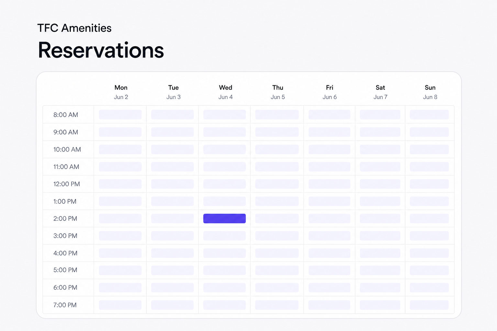

# TFC Amenities

A focused web interface for resident amenity reservations, including live
availability, immediate booking, cancellations, future auto-booking, and
recurring reservation requests.

**[Open the live TFC Amenities site](https://tfc-reserve.wongislandd.chatgpt.site/)**



## Security boundary

This public repository contains only the website. The private reservation
worker, Portico credential-recovery logic, database migrations, production
project identifiers, and secrets are intentionally excluded.

The browser receives an opaque session in a secure HTTP-only cookie. Portico
credentials, refresh tokens, scheduling records, and service-role access remain
server-side. Never add a Supabase secret/service-role key, Portico credential
encryption key, cron secret, or production environment file to this repository.

## Local development

Requires Node.js 22.13 or newer.

```bash
cp .env.example .env.local
npm install
npm run dev
```

Set `TFC_RESERVE_API_BASE_URL` in `.env.local` to your own compatible
reservation Edge Function. The production backend used by the linked site is
not included.

```bash
npm test
```

The application requires a server-capable deployment because its authentication
and reservation proxy use request-time route handlers and HTTP-only cookies. It
is not configured for GitHub Pages.
